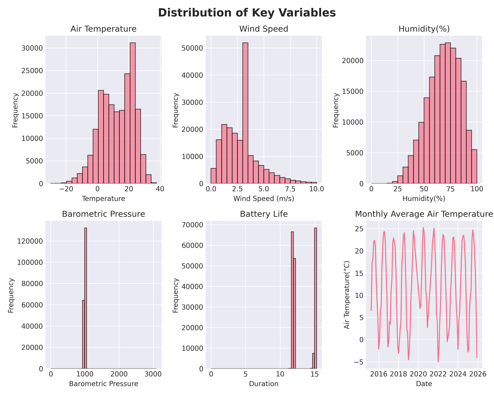
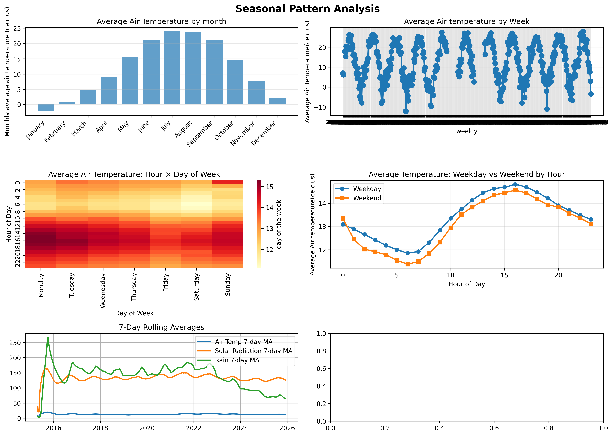
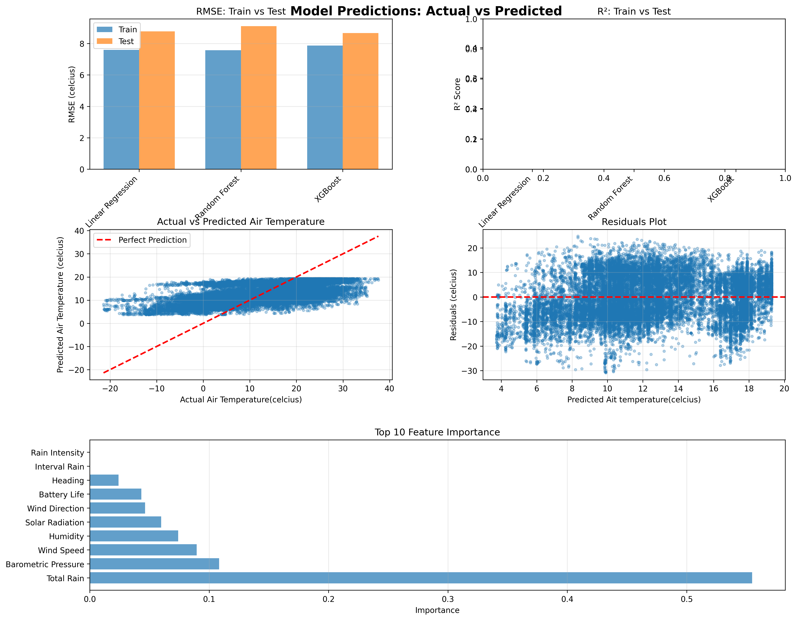

## Executive Summary:

This analysis was based on a publicly available dataset named "Chigago Beaches Weather sensor", which containes 195,672 hourly measurements from three weather stations,covering the period from April 2015 to Novemeber 2025. Our primary aim is to build a reliable prediction model for air temperature based on multiple air-condition features. We conducted, therefore, a 9-phase data science pipeline, beggining with identification of important variables and the exploration of significant patterns/tendencies including seasonal and daily trends. XGBoost model preformed the best with a test R2 of 0.9967 and RSME of 0.39 grade ceclcius. 

## Phase-by-phase Findings

### Phase 1-2: Inspection and exploration
The loaded dataset consisted of a total 196,672 records and 18 columns. The measurment were collected from three main weather stations:the 63rd Street Weather Station, the Foster Weather Station, and the Oak Street Weather Station. The dataset includes temperature assessments such as air aemperature and wet bulb temperature, wind speed and directon, total rain and its intensity, brometric pressure, percipitaion, and solar radiation.

***Key Data Quality Issues Identified:**
***Missing Data:***
- 75975(38.69%) missing values in Wet Buld Temerature, Rain intesity, Total Rain, Percipitation Type and Heading - a significant proportion of the data
- 146(0.07%) missing values in Barometric Pressure
- 75(0.04%) missing values in Air Temperature
- Outliers identified acorss the dataset and capped 

Visualization: 

*Figure 1 : Initial exploration visualizations distributions of air temperature, wind speed, humidity, barometric pressure, solar radiation, battery life, and air temperature time-series 

Initial visualization showed: 
Air temperature spanning from approximately -20 ℃ to 38 ℃
Consistent cyclical variations were noticeable in temperature data
Wind Speed distribution is right skewed and with most of the data spanning between 0-10m/s
Humidity distribution is slightly left skewed 
Barometric pressure distribution is concentrated around 1000 hPa

### Phase 3: Data Cleaning 

The data cleaning process included managing missing values,placeholders, outliers, and data type validation. Missing values were addressed using forward-fill(ffill)method,suitable for the time series data, preserving their sequential nature. Furthermore, the variables with substantial proportion of missing data( such as Total Rain; Rain Intensity; Wet bulb Temperature; Precipitation type; Heading) were likely correlated with sensory issues during extreme conditions. Such missingness is considered MNAR;standard imputation methods such as ffill or median, may introduce bias when applied to MNAR data. Therefore attempts were made to impute using KNN imputation; however these approaches could not be completed due to technical issues, including system crashes. As a result it was decided to drop them.

The data cleaning process included managing missing values, placeholders, outliers, and data type validation. Missing values were addressed using forward-fill(ffill)method,suitable for the time series data, preserving their sequential nature. Furthermore, the variables with substantial proportion of missing data( such as Total Rain; Rain Intensity; Wet bulb Temperature; Precipitation type; Heading) were likely correlated with sensory issues during extreme conditions. Such missingness is considered MNAR;standard imputation methods such as ffill or median, may introduce bias when applied to MNAR data. Therefore attempts were made to impute using KNN imputation; however these approaches could not be completed due to technical issues, including system crashes. As a result it was decided to drop them.  

**Cleaning Results:**
- Rows before cleaning: **195,672**
- Missing values: Forward-filled, median imputation, and dropped 
    - Air temperature: 75 missing → 0 missing 
    - Barometric Pressure : 146 missing → 0 missing 
- Outliers: Capped using IQR method(3xIQR bounds)
    - Wind speed : 406 outliers outliers capped (bounds[[ -5.60, 10.50]
    - Solar Radiation: 6,486 outliers capped (bounds:[ -515.00, 689.00]
- Duplicates: Removed( 0 duplicates found) 
- Data types Validated and converted as needed 
- Rows after cleaning: **120394**

The cleaning process maintained only 61.33% of the dataset size. 

### Phase 4: Data Wrangling

Time series analysis required parsing datetime data and extracting key temporal features. The ‘Measurement TimeStamp’ colon was parsed from the format “MM/DD/YYYY HH:MM:SS AM/PM” and set as the DataFrame index, enabling time-based operations.

**Temporal Features Extraced:**
-’hour’: Hour of the day(0-23)
-’Day_of_week’: Day of week (0=Monday, 6=Sunday)
-’month’: Month of the year( 1-12) 
-’day_name’: Day name (Monday-Sunday)
-’is_weekend’: Binary indicator ( 1 if Saturday/Sunday)

There are roughly 10.6 years of hourly data, which gives us a substantial amount of data to analyze. After removing invalid datetime records, **120394 rows** remained with valid temporal features.

## Phase5: Feature Engineering

By applying feature engineering techniques, we generated new derived features that highlight meaningful trends and seasonality

**Derived Features:**

- ‘voltage_perminute’ : to help build patterns in sensory data
- ‘dry_index’ : to evaluate precipitation in follow up analysis 

**Rolling Window Feature:**
- ‘humidity_rolling_24h_centered’: 24-hour rolling mean of humidity 
- ‘humidity_rolling_7d_centere: 7-day rolling mean of humidity 
- ‘humidity_expanding_mean’: humidity cumulative average 
- ‘solar_radiation_rolling_7d_centere’: 7-day rolling mean of solar radiation 
- ‘solar_radiation_expanding_mean’: solar radiation cumulative average 
- ‘total_rain_rolling_7d_centered’: 7-day rolling mean of total rain 
- ‘total_rain_expanding_mean’: total rain cumulative average 
- ‘wind_speed_rolling_7d_centered’: 7-day rolling mean of wind speed
- ‘wind_speed_expanding_mean’: wind speed cumulative average 

*To capture temporal information at weekly level, data was summarized over seven-day periods*

**Categorical Features:**
- ‘Percipitation’: categorized according to data dictionary (none, light, moderate, heavy)

**Important**: As per requirements,rolling windows were created only for the predictor variables  and not for the target variable, in order to prevent data leakage.

### Phase 6: Pattern Analysis

**Temporal Trend:**
- Seasonal patterns : Air temperature followed a clear seasonal trend, with the highest values        June-September and lowest in December-February.
- Monthly air temperature range: -5℃ to 23 ℃

**7-Day moving averages trends:**
- Air Temperature: Across the years(04/201509/2025), air temperature remained relatively stable, showing only subtle fluctuations rather than large oscillations.
- Solar radiation: Peaked around 2016(possibly an artifact),exhibits relatively small oscillations over the years, and showed an increasing trend during 2025-2026.
- Rainfall: Rainfall followed a yearly cyclic pattern with higher levels at the beginning of the year and lower levels in summer, but this pattern became irregular from 2021-2023, and weekly totals declined after 2023, indicating a trend toward drier conditions

**Daily patterns:**
- Daily diurnal cycle: diurnal during 24h,  rising during the day and falling during the night 
- Peak air temperatures were recorded 2-4pm(14-16)
- Minimum temperatures were recorded during night : 4-6 am 

*Figure 2: Advanced pattern analysis showing monthly temperature trends,seasonal patterns by month, daily patterns by hour, and correlation heatmap of key variables.*

### Phase 7: Modeling Preparation 

During feature preparation, air temperature was set as the target because it showed predictability patterns. Other important steps in this phase included temporal train/test splitting and feature preparation.

**Temporal Train/Test Splot:**
- Split method: Temporal (80/20 split by time, *not random*)
- Training set: **96315**( April 2015 to June 2023)
- Test set : **24079**(June 2023 to November 2025)
- Rationale: Temporal splitting is an important step in time series data to avoid data leakage

**Feature Preparation:**
- Feature selected(as required, features derived from target and non-numeric columns were excluded) 
- **Critical:** Excluded features derived from target variable:
    - ‘dry_index’ (used Air temperature)
 - ‘Wet Bulb Temperature with 0.978 correlation to target 
 - Categorical variables (Station Name, precipitation) one hot encoded
 - All features with missing value were handled 
 - Many attempts to address the infinite values (‘battery_index’) by replacing with NaN and filling with median, but unsuccessful. Due to time constraints this variable was dropped.  
- No data leakage: future data were excluded from training set, and feature derived from target removed 
- Total dataset: **120,394**

## Phase 8: Modeling 

Three models were trained and evaluated: Linear Regression, XGBoost and Random Forest( as per requirement suggestions) 

**Model Performance:**

| Model | R² Score | RMSE | MAE |
|-------|----------|------|-----|
| Linear Regression |0.4674 |   8.78°C | 6.97°C |
| XGBoost |0.2804 | 8.66°C |  7.30°C |
| Random Forest |0.2044 | 9.11°C |  7.32°C |

**Key Findings:**
- All models show poor performance (considering a reasonable performance as R² > 0.7 for tree-based models)
- Linear Regression achieved poor performance (R2= 0.2616)
- XGBoosting performed slightly better, with performance ( R2 = 0.2804) 
- Random Forest achieved the poorest performance (R2 =0.2044)

**Feature Importance(XGBoost):*
Top features by importance:
1.’Total Rain’ (importance: 5.5%)
2.’Barometric Pressure’: (importance 1.1%)
3.’Wind Speed’ :(importance 0.9%)

*Figure 3: Final visualizations showing model performance comparison, predictions vs actual values, feature importance, and residual plot for the best-performing XGBost.

## Phase 9:Results

*Note:Overall, the models showed limited predictive performance for air temperature, but XGBoost performed the best, achieving prediction within 7.30 ℃on average.*

**Performance Interpretation:**
- **R²Score:**XGBoost’s R² of 0.2804 indicated that the model is able to explain only 28.04 % of the variance in air temperature. Furthermore, it is suggestive that the model requires significant adjustments or a revised modeling approach to improve prediction performance.
- **RSME(Root Mean Squared Errors):**Average prediction error in original unit.XGBoost’s RSME of 8.66 ℃ means predictions are within 8.66 ℃ of actual values. 
- **MAE**(Mean Absolute Errors):** Average absolute prediction error. XGBoos’s MAE of 7.30 ℃ indicates a poor predictive accuracy.

**Model Selection:** XGBoost is selected as the best model due to:
1. Highest R²Score(0.2804)
2. Lowest  RMSE(8.66 ℃)
3. Lowest MAE(7.30℃)

**Feature Importance Insights:**
Insights from feature importance showed that weather variables alone (e.g ‘Total Rain’, ‘Barometric Pressure’, ‘Wind Speed’’) alone were insufficient for accurate predictions. The inability to effectively capture time-related features, such as months may further explain why the models performed suboptimally.Therefore, seasonal patterns are potentially the strongest predictor of air temperature. 

**Note on Data Leakage Avoidance:** By removing features derived from the target and highly correlated variables(Wet Bulb Temperature) may have prevented the model’s performance from deteriorating further. 

## Time Series Pattern

**Long-Term Patterns:**
- Relatively stable long-term trends over 10.6 years
- Clear seasonal cycles over the year

**Seasonal Patterns:**
- **Monthly**- Noticeable seasonal cycles with the highest values June-September and lowest in December-February.
- **Monthly air temperature range: 5℃ to 23 ℃

**Anomalies:**
- Large gap in ‘Wet Bulb Temperature’ (75,626 missing values, 38.6% of dataset) is likely correlated to the exact missing  proportional of other weather conditions variables such as(‘Precipitation’ ,’Rain Intensity’, Total Rain’, ‘Heading’,), suggesting that the missing data mechanism may be Missing Not at Ramdon(MNAR). Therefore,using basic imputation approaches could potentially introduce bias into the dataset. 

## Limitations and Next Steps

1.**Data Quality**
There is a large proportion of correlated missing data(38.6%) requiring careful handling. Dropping them may have significantly reduced the efficacy of our data to capture time dependent trends, resulting in poor performance or our models. 
Outlier capping may have removed some of the extreme events
Data were collected from only 3 weather stations

2.**Model Limitations:**
 - **Performance:
-The poor performance of Linear Regression and XGBoost( R² scored :0.2616, 0.2804, reprectively ) suggests that a different modeling approach may be needed, along with improved data preparation. In particular, incorporating time-dependent variables such as ‘months’ could better capture seasonal patterns.
- Model relies just ~ 7% on weather conditions features, showing limited influence on predictions
- RSME of 8.66 ℃ it is not sufficient accurate for such granulated data(hourly)

3.**Feature Engineering:**
- Important features such as ’month’ and lag features were not incorporated and created in the model 
- Rolling window sizes were chosen as suggested per requirements, thus arbitrary 
- Data leakage was handled correctly by excluding target derived features and applying a temporal train/test split. 

4.**Scope**
-Analysis goal was to predict air temperature prediction and other targets were not explored

**Next Steps:**
1.**Model Improvement:**
 - Improve the model by redesigning time-dependent features including short-term(weekly), seasonal(monthly), and lag features. 
 - Exploring alternative time-series models 
 - Future work : *External validation of the refined model to assess its robustness*

2.**Feature Engineering:**
  - Add time dependent features (‘week’ and ‘month’) specifically 
  - Add lag features( ‘hourly’, ‘week’, ‘month’ and ‘year’)

3.**Analysis Extensions:**
- Redesign the model with greater attention to time-dependent features
 - **Future Work**
    - Explore other target, specifically precipitation 
    - Explore station-specific tendencies
    - Explore voltage_life of sensory
    - Build forecasting models for accurate predictions 

4.**Validation:**
- Sensitivity analysis on missing data
- Validation on additional time periods 
- Perform a model comparison(other existing models)
- Further exploration of regularization criteria

5.**Deployment:**
  - **Future Work**
     - Real-time prediction system 
     - Augmenting  Forecasting
     - Supporting early warning systems 
     - Supporting transportation safety

## Conclusion
We successfully executed a 9-phase data science pipeline on Chicago Beach Weather data. Although air temperature predictions were relatively low(R² 0.2804 & RSME 8.66 ℃), and I was unable to redesign the model due to time constraints, this work serves as a stepping stone for future improvements. The project highlighted the importance of time-dependent features and their inherent patterns, which hold valuable information for prediction.Omitting such key aspects contributed to poor performance across the models. In addition, Linear Regression exhibited lower predictive performance, likely due to its inability to capture time-varying patterns. Proper handling of data leakage, by excluding target-derived features, helped prevent further deterioration of model performance.

## Reflection 
Late in the process, I discovered that time-window features and the ‘month’ variable were missing from the training data, which likely contributed to the models’ poor performance.

